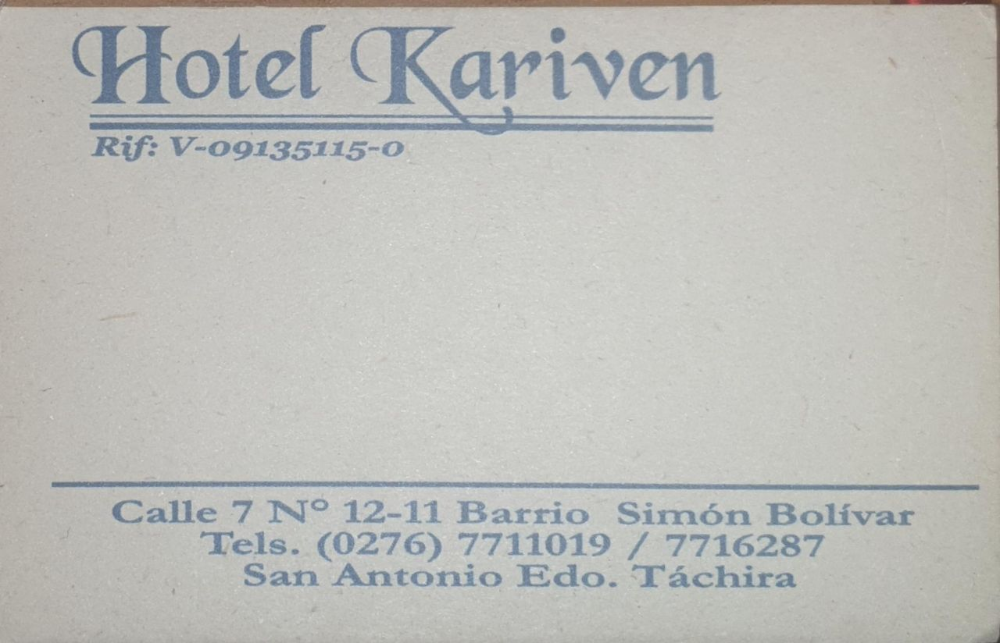

# **El periplo para viajar a sacar el pasaporte: De Bogota a San Antonio del Tachira**

## **Primera parte de Bogota a Cucuta**

Esta primera parte realmente no acarrea ningún misterio programamos un viaje via Avianca desde Bogota a Cucuta solo recordar que se necesita estar 2 horas antes en los vuelos locales.

## **Ya en Cucuta**

Al llegar a Cucuta nos quedamos en el Hotel Casino pero existen infinidad de opciones nosotros por desconocimiento llegamos 3 días antes pero mi recomendación es que estés en el Tachira el mediodía anterior al dia de tu cita, para que logres con calma coordinar tu hotel, buscar comida y hacer la fila pero ya te explico esto. Si requieres quien te busque del aeropuerto y te lleve al puente o a Cucuta recomiendo a **Luis Moya** (pídeme el numero en los comentarios) quien tiene mucha experiencia y es muy cumplido, cuando estés llegando al puente saldrá mucha gente corriendo a tu auto al mejor estilo de los zombie para buscar cruzarte el puente, te recomiendo tener los vidrios del auto cerrados.

## **Cruzar el puente**

Para cruzar el puente lo mas recomendable es hacerlo con uno de los carretilleros que siempre lo hacen y allí Luis Moya tiene uno muy bueno llamado Moises, pídanle a Luis que los ponga en contacto el costo es 60.000 Pesos Colombianos (COP).  De allí cuando pasas te revisa la gente del **SENIAT** en mi caso no se fijaron muchos en nosotros y en 4 minutos si no tienes inconveniente estas en Venezuela en San Antonio.

## **Lo primero en que se debe hacer en San Antonio**

Definitivamente lo primero que se debe hacer es buscar un hotel (si requerirá por lo menos 2 días hacer todo) yo recomiendo uno llamado Kariven que dejare la foto pues tiene plata y por lo menos eso te garantiza luz y un internet que te va a ayudar algo.

<noscript>Please enable JavaScript to view the <a href="https://disqus.com/?ref_noscript">comments powered by Disqus.</a></noscript>
                            